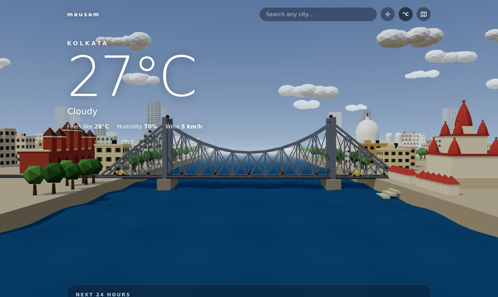
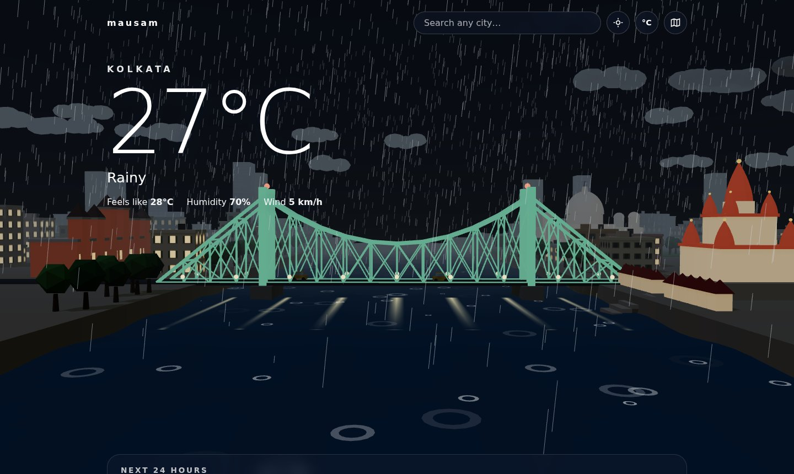
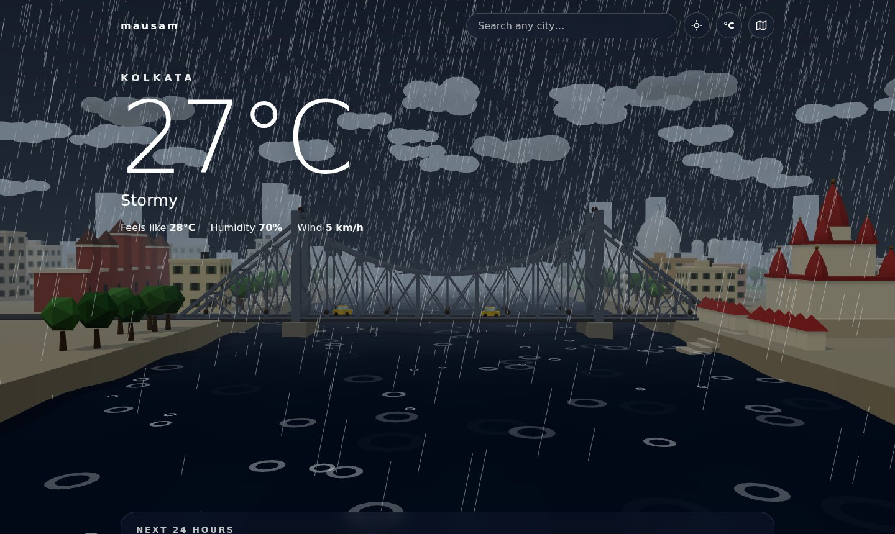
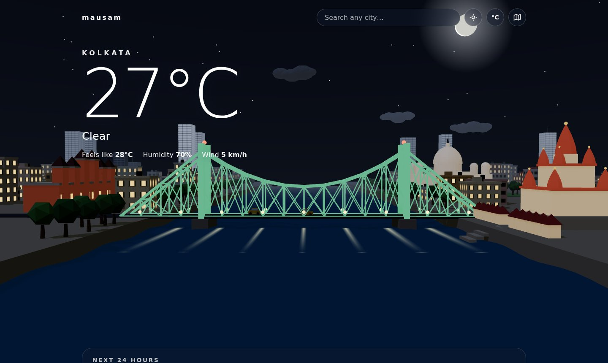
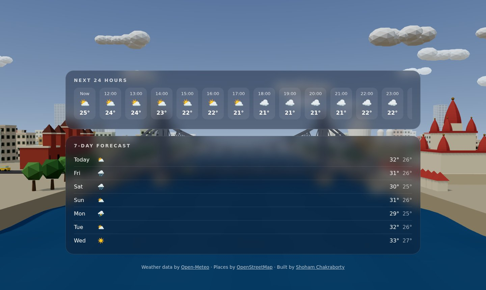
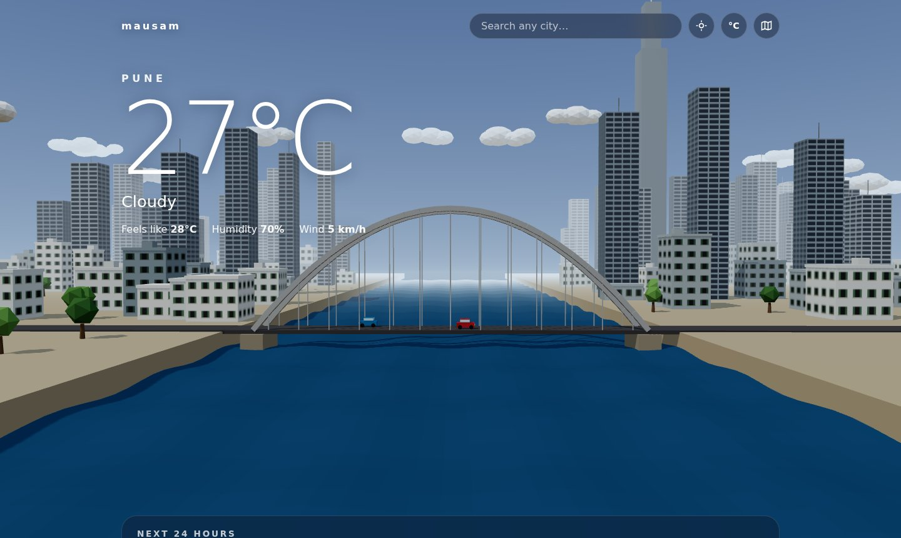
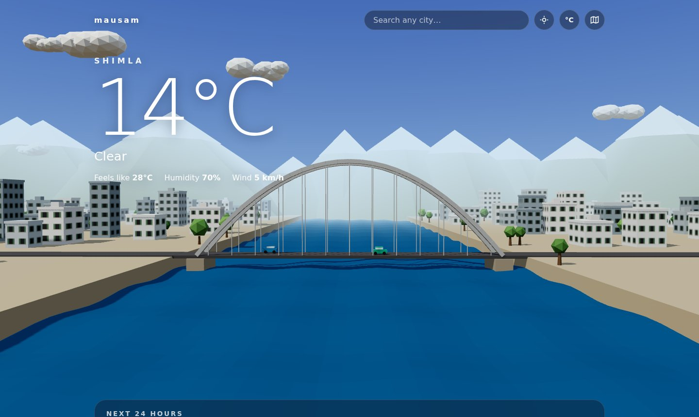
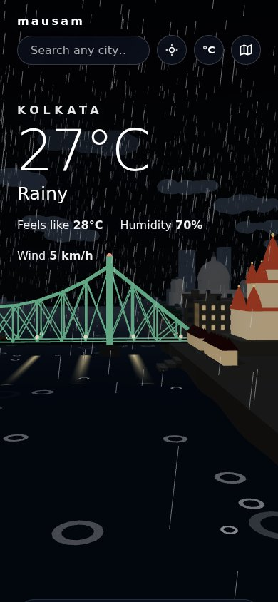

# 🌦️ Mausam

**Live weather for any place on Earth, shown as an animated 3D city.**

When it rains in Kolkata, it rains on the Howrah Bridge. When a storm rolls in, lightning lights up the Hooghly. At night the bridge's LED lights glow and the city's windows switch on.

### [▶ Open Mausam](https://shohamchakraborty.github.io/mausam/)



---

## Features

- **Real-time weather.** Current conditions, a 24-hour forecast and a 7-day forecast from the Open-Meteo API.
- **A hand-built 3D Kolkata.** The Howrah Bridge (full steel truss), Dakshineswar Temple with its ghat, Victoria Memorial, Howrah Station, yellow Ambassador taxis, and old-Kolkata buildings with green shutters and rooftop water tanks.
- **Weather that happens in the scene.** Rain with ripples on the river, storms with lightning, drifting fog, clouds, and a full night mode with stars, moon, floodlit landmarks and lamp reflections on the water. Changes fade smoothly from one mood to the next.
- **Any city in the world.** Search by name, use your location, or tap anywhere on a map. Every other city gets a **procedurally generated skyline**: the city's name seeds the randomness, so each city looks unique but identical on every visit. Population controls density and height; elevation adds mountain ranges and snow caps.
- **Shareable links.** The address bar always holds the current place, e.g. `?name=Pune&lat=18.520&lon=73.860`.
- **Built for every device.** It measures its own frame rate and switches to lighter graphics on slow phones. The camera pans along the riverfront on narrow screens and stays still for people who turn on "reduce motion". Temperature units switch between °C and °F.

## Screenshots

| Rainy night | Storm |
|---|---|
|  |  |
| **Clear night** | **Forecast** |
|  |  |
| **Pune (generated)** | **Shimla (generated, high altitude)** |
|  |  |

<p align="center"></p>

## Try it yourself

Add these to the end of the address to preview any weather without waiting for it:

| Address ends with | Shows |
|---|---|
| `?weather=stormy` | A storm with lightning |
| `?weather=rainy&night=1` | A rainy night |
| `?weather=foggy` | Fog over the river |
| `?weather=clear&night=1` | Stars and the moon |
| `?quality=low` | The lighter graphics used on slow devices |

## How it works

```
app.js ──► fetches the weather ──► announces it ──► scene.js
                                                     ├── weather.js   rain, clouds, fog, lightning, night
                                                     ├── kolkata.js   the hand-built city
                                                     └── generic.js   generated cities for everywhere else
```

1. **`app.js`** asks Open-Meteo for the weather, fills in the page, and turns the weather code into one of five moods: clear, cloudy, foggy, rainy or stormy. It then announces the result with a browser event.
2. **`scene.js`** sets up the 3D world with Three.js (camera, sky shader, sun, river) and listens for that event.
3. **`weather.js`** holds a table of moods (sky colours, fog distance, number of clouds, river colour). Every frame, the scene slides a little closer to the target mood, which is what makes the transitions smooth.
4. **`kolkata.js`** builds the city from basic 3D shapes. The bridge's steel truss is generated by code, and the temple spires are made by spinning a curve (`LatheGeometry`).
5. **`generic.js`** generates every other city. It hashes the city name into a seed for a random-number generator, so the "random" city is the same on every visit.
6. **`search.js`** handles the search box (Open-Meteo geocoding), "use my location", and the Leaflet map (with Nominatim to name the spot that was tapped).

## Tech

- **JavaScript** (no framework, no build step)
- **Three.js** for 3D, including a custom GLSL shader for the sky
- **Leaflet** for the map
- **Open-Meteo** for weather and place search, and **Nominatim / OpenStreetMap** for naming map locations
- **HTML and CSS** (CSS grid and flexbox, frosted-glass panels, responsive layout)
- Hosted on **GitHub Pages**

## Project structure

```
index.html     the page
style.css      how it looks
app.js         weather data and the forecast panels
search.js      search box, location button, map
scene.js       3D world: camera, sky, river, animation loop, quality control
weather.js     rain, clouds, fog, lightning, stars, moon, day/night moods
helpers.js     small 3D building blocks (box, dome, beam, seeded randomness…)
city-kit.js    shared city parts: buildings, trees, cars, night lights
kolkata.js     the hand-built Kolkata scene
generic.js     generated cities for everywhere else
docs/          screenshots for this README
```

## Run it locally

No installs needed. Clone the repo and open `index.html` with a local server, for example the **Live Server** extension in VS Code. Opening the file directly doesn't work, because browsers only load JavaScript modules through a server.

```bash
git clone https://github.com/shohamchakraborty/mausam.git
```

## Credits

- Weather and geocoding data: [Open-Meteo](https://open-meteo.com/) (CC BY 4.0)
- Map data: © [OpenStreetMap](https://www.openstreetmap.org/copyright) contributors, map tiles by [CARTO](https://carto.com/attributions)
- 3D: [Three.js](https://threejs.org/) · Map: [Leaflet](https://leafletjs.com/)

---

Built by [Shoham Chakraborty](https://github.com/shohamchakraborty) · Also check out the live weather card on my [GitHub profile](https://github.com/shohamchakraborty).
